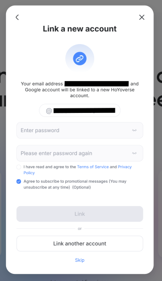

# Account Pre-Setup Guide

> [!NOTE]  
> If you already have a Hoyoverse account, you can skip this guide and go to [Getting Started](./Getting-Started.md).
>
> Setting up a Hoyoverse account is only needed if you want to login with the email and password method. If you wish to login with DevTools, you can skip this guide. [Which login method should I use?](./FAQ.md#which-login-method-should-i-use)

## I Login With 3rd-Party Services

"3rd-party services" refer to Google, Apple, Facebook, X, etc.

First, go to [HoYoverse Account Center](https://account.hoyoverse.com).

Click "Log In" and choose the third-party provider you use to login to your game.

After logging in, 3 things can happen:

### Link a New Account

This means that the email you used to login is not linked to any Hoyoverse account. Enter a desired password and click "Link", this will create a new Hoyoverse account and bind it to the third-party login you used.

You can then use this email and password to login to Hoyo Buddy.

### Link Email

This means that a Hoyoverse account was created automatically when you logged in with the third-party provider. Click "Link".

On the next screen, click "Manage" in the "Password and Security" section.

Click on "Update" and follow the instructions to set a password for your account.

You can then use this email and password to login to Hoyo Buddy.

### Link to an Existing Account

This means a Hoyoverse account with the same email already exists. Enter the password of this Hoyoverse account and click "Link" to bind the third-party login to the existing account. If you forgot the password, click "Having problems?" -> "Forgot Password?" to reset it.

You can then use this email and password to login to Hoyo Buddy.

### Password Last Updated Date is "-"

Follow the same steps as [Link Email](#link-email) to set a password for your account.

### Other Scenarios

If you encounter scenarios not listed above, please find help in the [Discord server](https://link.seria.moe/hb-dc).

## I am a Console Player

### I Don't Have a Hoyoverse Account

Go to [HoYoverse Account Center](https://account.hoyoverse.com) and sign up for an account.

Proceed to [I have a Hoyoverse Account](#i-have-a-hoyoverse-account) after signing up.

### I Have a Hoyoverse Account

**[PlayStation Only]**: Please check your region account before linking your HoYo account to PSN. See the chart below. Applies to all HoYoverse games

Launch the game and choose "Already have an Account, log in directly"

> [!TIP]
> If you don't see this screen, that means your game account is already linked to a Hoyoverse account. You can skip this guide and go to [Getting Started](./Getting-Started.md).

Login with the Hoyoverse account you already have/created earlier.

#### Xbox

Check if the the information is correct.

#### PlayStation

> [!IMPORTANT]  
> PSN User please double check that your account region is correct with your server region. If the game asks you to create a new game account, close the game and double check if your region account is correct as in the chart.

If you are sure the region is correct. Confirm the link.

**Congrats! You can now play any HoYoverse game cross-platform with Hoyo Buddy enhancement!** Check out [Getting Started](./Getting-Started.md) to set up Hoyo Buddy.
