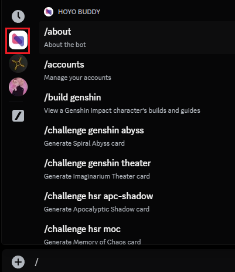

# Getting Started

<!-- markdownlint-disable MD033 -->

## Try out Hoyo Buddy today

You can use Hoyo Buddy without inviting it into any Discord servers.
If you need help setting up Hoyo Buddy, please join our [Discord server](https://link.seria.moe/hb-dc).

1. Click on [this link](https://discord.com/oauth2/authorize?client_id=1000045812522430626).

2. Select the option you want.

<!-- markdownlint-disable MD029 -->
3. Go to Discord and type `/`, then select Hoyo Buddy's icon (blue and red triangles). You should now see all available commands of Hoyo Buddy, select any command to run it.

Read more: Is Hoyo Buddy safe?

### Post-Set Up

After setting up your account(s), you can toggle feature like auto daily check-in and auto code redemption for individual accounts.
The "Set account as public" toggle controls whether your account is visible to others when they select you as the command user.

## Viewing All Commands

Type `/` in the textbox, then select Hoyo Buddy's profile picture (red + blue triangles). Alternatively, open the activity launcher and select Hoyo Buddy's profile picture. You can now see all commands Hoyo Buddy has.

## Reporting Issues and Giving Suggestions

Please join our [Discord server](https://dsc.gg/hoyo-buddy).

## Other Usage Tips

You can use the `/settings` command to control the theme of images generated by Hoyo Buddy (light or dark theme), and the language of contents displayed by Hoyo Buddy.
