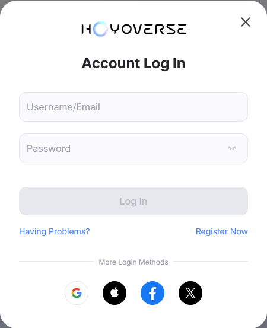
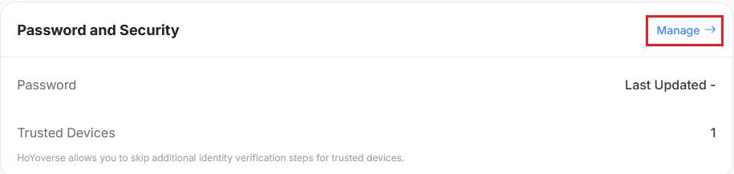

# Guía de pre-configuración de cuenta

:::note

Si ya tienes una cuenta de Hoyoverse, peudes saltarte esta guía y ve a [Primeros Pasos](./Getting-Started.md).

Configurar una cuenta de Hoyoverse solo es necesario si desea iniciar sesión con el método de correo y contraseña. Si deseas iniciar sesión con DevTools, puedes saltarte esta guía. [¿Qué método de inicio de sesión debería usar?](./FAQ.md#que-metodo-de-inicio-de-sesion-deberia-usar)

:::

## Iniciar sesión con servicios de terceros

"Servicios de terceros" se refiere a Google, Apple, Facebook, X, etc.

Primero, ve a [Centro de Cuenta de Hoyoverse](https://account.hoyoverse.com).

Haz clic en "Iniciar sesión" y elige el proveedor de terceros que usas para iniciar sesión en tu juego.

Después de iniciar sesión, pueden pasar 3 cosas:

### Vincula una nueva cuenta

Esto significa que el correo electrónico que haz usado para iniciar sesión no está vinculado a ninguna cuenta de Hoyoverse. Introduce una contraseña deseada y haz clic en "Vincular", esto creará una nueva cuenta de Hoyoverse y la vinculara al inicio de sesión de terceros que usaste

Puedes usar este correo y contraseña para iniciar sesión en Hoyo Buddy.

### Vincular correo

Esto significa que una cuenta de Hoyoverse se creó automáticamente cuando iniciaste sesión con el servicio de terceros. Haz clic en "vincular"

En la siguiente pantalla, haz clic en "Gestión" en la sección "Contraseña y seguridad"

Haz clic en "Actualizar" y sigue las instrucciones para establecer una contraseña para tu cuenta

Puedes usar este correo y contraseña para iniciar sesión en Hoyo Buddy.

### Vincular una cuenta existente

Esto significa que una cuenta de Hoyoverse con el mismo correo y existe. Introduce la contraseña de esta cuenta de Hoyoverse y haz clic en "Vincular" para unir el inicio de sesión de terceros en la cuenta existente. Si olvidaste la contraseña, haz clic en "A ocurrido un problema" -> "¿Olvidaste tu contraseña?" para restablecer.

Puedes usar este correo y contraseña para iniciar sesión en Hoyo Buddy.

### Última actualización de contraseña es "-"

Sigue los pasos de [Vincular correo](#vincular-correo) para establecer una contraseña para tu cuenta.

### Otros escenarios

Si te encuentras con escenarios no mencionados anteriormente, por favor busca ayuda en el [servidor de Discord](https://link.seria.moe/hb-dc).

## Soy un jugador de Consola

:::note

Si tu cuenta de PlayStation o Xbox está vinculada a una cuenta de Hoyoverse, puedes saltarte esta guía e ir a [Primeros Pasos](./Getting-Started.md).

:::

### Cómo acceder al centro de usuario

- **Genshin Impact**: Menú de Paimon -> Ajustes -> Cuenta -> Centro de usuario

- **Honkai: Star Rail**:

  - *Pantalla de inicio de sesión*: Ajustes -> Cuenta -> Centro de usuario (Recomendado si no quieres descargar todo el juego)

  - *En el juego*: Teléfono -> Ajustes de cuenta -> Centro de usuario

- **Zenless Zone Zero**: Menú -> Ajustes -> Cuenta -> Centro de usuario

### Cómo vincular tu cuenta de Hoyoverse

:::warning

Este método creará una nueva cuenta de Hoyoverse y vinculará los datos actuales guardados en tu consola a esa nueva cuenta. Vincular una cuenta de Hoyoverse existente de no es posible.

:::

1. Inicia el juego que deseas vincular a tu cuenta de Hoyoverse.
2. Abre el [Centro de usuario](#cómo-acceder-al-centro-de-usuario) en el juego.
3. Selecciona "Vincular cuenta" o una opción similar.
4. Sigue las instrucciones en pantalla para vincular tu cuenta de Hoyoverse.
