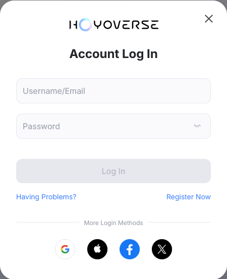
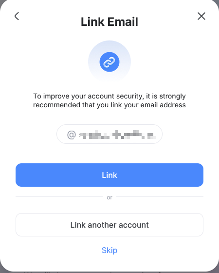
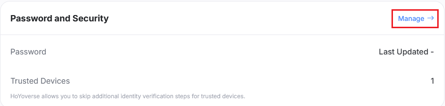
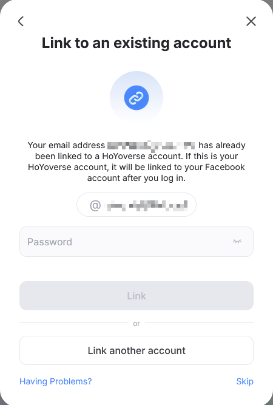

# Hướng dẫn thiết lập trước tài khoản

:::note

Nếu bạn đã có tài khoản Hoyoverse, bạn có thể bỏ qua hướng dẫn này và đi đến [Bắt đầu](./Getting-Started.md).

Setting up a Hoyoverse account is only needed if you want to login with the email and password method. If you wish to login with DevTools, you can skip this guide. [Which login method should I use?](./FAQ.md#which-login-method-should-i-use)

:::

## Tôi dăng nhập bằng dịch vụ bên thứ ba

"Dịch vụ của bên thứ 3" đề cập đến Google, Apple, Facebook, X, v.v.

Đầu tiên, hãy truy cập [Trung tâm tài khoản HoYoverse](https://account.hoyoverse.com).

Nhấp vào "Đăng nhập" và chọn nhà cung cấp bên thứ ba mà bạn sử dụng để đăng nhập vào trò chơi của mình.

Sau khi đăng nhập, 3 điều có thể xảy ra:

### Liên kết tài khoản mới

This means that the email you used to login is not linked to any Hoyoverse account. Enter a desired password and click "Link", this will create a new Hoyoverse account and bind it to the third-party login you used.

Sau đó, bạn có thể sử dụng email và mật khẩu này để đăng nhập vào Hoyo Buddy.

### Liên kết Email

This means that a Hoyoverse account was created automatically when you logged in with the third-party provider. Click "Link".

Trên màn hình tiếp theo, nhấp vào "Quản lý" trong phần "Mật khẩu và Bảo mật".

Nhấp vào "Cập nhật" và làm theo hướng dẫn để đặt mật khẩu cho tài khoản của bạn.

Sau đó, bạn có thể sử dụng email và mật khẩu này để đăng nhập vào Hoyo Buddy.

### Liên kết đến Tài khoản Hiện có

This means a Hoyoverse account with the same email already exists. Enter the password of this Hoyoverse account and click "Link" to bind the third-party login to the existing account. If you forgot the password, click "Having problems?" -> "Forgot Password?" to reset it.

Sau đó, bạn có thể sử dụng email và mật khẩu này để đăng nhập vào Hoyo Buddy.

### Trường hợp khác

Nếu bạn gặp phải những tình huống không được liệt kê ở trên, vui lòng tìm trợ giúp trong [máy chủ Discord](https://link.seria.moe/hb-dc).

Follow the same steps as [Link Email](#link-email) to set a password for your account.

### Other Scenarios

Nếu tài khoản PlayStation hoặc Xbox của bạn được liên kết với tài khoản Hoyoverse, bạn có thể bỏ qua hướng dẫn này và đi tới [Bắt đầu](./Getting-Started.md).

## I am a Console Player

:::note

If your PlayStation or Xbox account is linked to a Hoyoverse account, you can skip this guide and go to [Getting Started](./Getting-Started.md).

:::

### How to Access the User Center

- **Genshin Impact**: Paimon Menu -> Settings -> Account -> User Center

- **Honkai: Star Rail**:

  - _Login Screen_: Settings -> Account -> User Center (Recommended if you don't want to download the entire game)

  - _In-Game_: Phone -> Account Settings -> User Center

- **Zenless Zone Zero**: Menu -> Options -> Account -> USER CENTER

### How to Link Your Hoyoverse Account

:::warning

This method will create a new HoYoverse account and link the current saved data on your console to that new account. Linking to an existing Hoyoverse account is not possible.

:::

1. Launch the Hoyoverse game that you want to link to your Hoyoverse account.
2. Open the [User Center](#how-to-access-the-user-center) in the game.
3. Select "Link Account" or a similar option.
4. Follow the on-screen instructions to link your Hoyoverse account.
