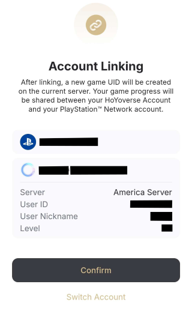

# Thiết lập trước tài khoản

Khi bạn sử dụng Hoyo Buddy lần đầu tiên, bạn cần liên kết email và mật khẩu hoặc sử dụng DevTools để liên kết. Hầu hết những thông tin đó đều có trong [FAQ](./FAQ.md).

Nhưng có những người dùng sử dụng Đăng nhập nền tảng của bên thứ ba (ví dụ: Apple ID, Game Center, Google, PlayStation, Microsoft, Facebook và Twitter).

Trang này sẽ giúp bạn thiết lập tài khoản HoYoverse để sử dụng với Hoyo Buddy

## Là người chơi lần đầu tiên mà chưa có tài khoản nào

Nếu đây là lần đầu tiên bạn nghe về bất kỳ trò chơi HoYoverse nào và bạn muốn sử dụng Hoyo Buddy với tài khoản HoYoverse của mình, trước tiên hãy tạo một tài khoản mới trên [Trung tâm tài khoản HoYoverse](https://account.hoyoverse.com).

Chọn Đăng Nhập -> Đăng ký ngay và làm theo hướng dẫn trên màn hình.

Nếu bạn dự định đăng nhập bằng bên thứ ba, vui lòng chọn nhà cung cấp bên thứ ba trước. (Google, Facebook, Twitter(X), Apple)

Sau khi liên kết, một màn hình có thể bật lên yêu cầu liên kết email hiện tại với tài khoản HoYoverse. Vui lòng đảm bảo liên kết email của bạn và thêm mật khẩu để hoàn tất việc tạo tài khoản để sử dụng Hoyo Buddy.

**Lưu ý**: <u>Hoyo Buddy có thể đăng nhập bằng bên thứ ba mà không cần email, nhưng bạn phải sử dụng Google, Apple, Twitter (X) hoặc Facebook để đăng nhập vào HoYoLAB và CHỈ DevTools mới được phép Đăng nhập. Một số Tính năng của Hoyo Buddy sẽ bị hạn chế.</u>

## Đối với người dùng hiện tại

### Liên kết email từ tài khoản đăng nhập bằng nền tảng bên thứ ba

Nếu bạn sử dụng bên nền tảng đăng nhập thứ ba làm thông tin đăng nhập chính. Hãy vào [Trung tâm tài khoản HoYoverse](https://account.hoyoverse.com). Vào "Thông tin cá nhân" và liên kết email và mật khẩu.

Khi đã vào, hãy nhấp vào "Liên kết" bên cạnh Liên kết email và làm theo hướng dẫn trên màn hình

Để liên kết trong trò chơi, hãy vào Trung tâm người dùng và liên kết email và mật khẩu của bạn tại đó.

- **Honkai Impact 3rd**: "LV.[XX] [Tên]" -> Tài Khoản -> Trung tâm Người dùng

- **Genshin Impact**: Menu Paimon -> Cài đặt -> Tài Khoản -> Trung tâm Người dùng

- **Honkai: Star Rail**:

  - *Màn hình đăng nhập*: Cài đặt -> Tài Khoản -> Trung tâm Người dùng (Khuyến nghị nếu bạn không muốn tải toàn bộ tài nguyên trò chơi)

  - *Trong Game*: Điện Thoại -> Thiết lập Tài Khoản -> Trung tâm Người dùng

- **Zenless Zone Zero**: Menu -> Thiết Lập -> Tài Khoản -> Trung tâm Người dùng

### Liên kết nền tảng bên thứ ba từ tài khoản đăng nhập bằng email

Hoyo Buddy chỉ sử dụng Email và Mật khẩu hoặc thông tin đăng nhập DevTools để truy cập tài khoản của bạn. Nếu bạn muốn liên kết đến nền tảng của bên thứ ba, vui lòng truy cập Liên kết Tài khoản trên [Trung tâm Tài khoản HoYoverse](https://account.hoyoverse.com). Chỉ có thể liên kết Nền tảng Facebook và Twitter (X), đối với các nền tảng khác, vui lòng liên kết chúng trong trò chơi trên thiết bị bạn muốn liên kết.

- **Game Center (iCloud)**: iOS (Trong Game)

- **Đăng Nhập bằng Apple**: iOS (Trong Game), Web (dành cho đăng ký lần đầu).

- **Google**: Android (Trong Game), PC* (Trong Game), Web (dành cho đăng ký lần đầu).

- **Microsoft Account**: Xbox (Trong Game - [Trên Console](./Before-Start.md#liên-kết-từ-console)).

- **PlayStation Network**: PlayStation** (Trong Game - [Trên Console](./Before-Start.md#liên-kết-từ-console))

*Để liên kết tài khoản HoYo hiện tại của bạn với Tài khoản Google trên PC, vui lòng tải xuống [Genshin Impact](https://genshin.hoyoverse.com) hoặc [Honkai Impact 3rd](https://honkaiimpact3.hoyoverse.com/) - Google Play PC trên Cửa hàng Google Play từ Trang trò chơi chính thức. Trò chơi Google Play PC sẽ được cài đặt sau, bằng trình cài đặt HoYoPlay của trò chơi cụ thể.

Sau khi cài đặt hoàn tất và trò chơi đã sẵn sàng chạy, hãy khởi chạy trò chơi và đăng nhập vào tài khoản HoYoverse hiện có của bạn.

Sau khi đăng nhập, một màn hình sẽ bật lên yêu cầu đăng nhập bằng Google Play. Làm theo hướng dẫn trên màn hình để hoàn tất quá trình liên kết.

**Lưu ý**: *Phiên bản Google Play PC chỉ cho phép liên kết. Để hủy liên kết tài khoản Google của bạn, vui lòng Hủy liên kết trên Thiết bị Android của bạn.*

***Khu vực tài khoản trò chơi của bạn bị giới hạn theo khu vực tài khoản PSN mà bạn đặt, xem thông tin bên dưới để biết thêm thông tin.

## Liên kết từ Console

Bằng cách sử dụng Hoyo Buddy, bạn có thể sử dụng các tính năng mà người dùng di động và PC có.

Đối với người dùng mới bắt đầu sử dụng bảng điều khiển, vui lòng làm theo [Liên kết email từ thông tin đăng nhập của bên thứ ba](./Before-Start.md#liên-kết-email-từ-tài-khoản-đăng-nhập-bằng-nền-tảng-bên-thứ-ba)

Đối với người dùng hiện tại, hãy làm theo hướng dẫn bên dưới.

**[Chỉ PlayStation]**: Vui lòng kiểm tra tài khoản khu vực của bạn trước khi liên kết tài khoản HoYo của bạn với PSN. Xem biểu đồ bên dưới. Áp dụng cho tất cả các trò chơi HoYoverse

Đăng nhập vào một trong các trò chơi HoYo và chọn "Đã có tài khoản, đăng nhập trực tiếp"

Nếu bạn chỉ sử dụng thông tin đăng nhập của bên thứ ba, hãy Quét Mã QR nếu bạn chỉ muốn sử dụng thông tin đăng nhập DevTools.

Khi sử dụng QR Link, hãy kiểm tra xem thông tin có chính xác không.

**Lưu ý**: Người dùng PSN vui lòng kiểm tra lại xem vùng tài khoản của bạn có đúng với vùng máy chủ của bạn không. Nếu trò chơi yêu cầu bạn liên kết tạo tài khoản trò chơi mới, hãy đóng trò chơi và kiểm tra lại xem tài khoản vùng của bạn có đúng như [bảng trên](./Before-Start.md#liên-kết-từ-console) không.

Nếu bạn chắc chắn vùng là đúng. Xác nhận liên kết.

**Xin chúc mừng! Bây giờ bạn có thể chơi bất kỳ trò chơi HoYoverse nào trên nhiều nền tảng với cải tiến Hoyo Buddy!** Hãy xem [Bắt đầu](./Getting-Started.md) để Thiết lập Hoyo Buddy