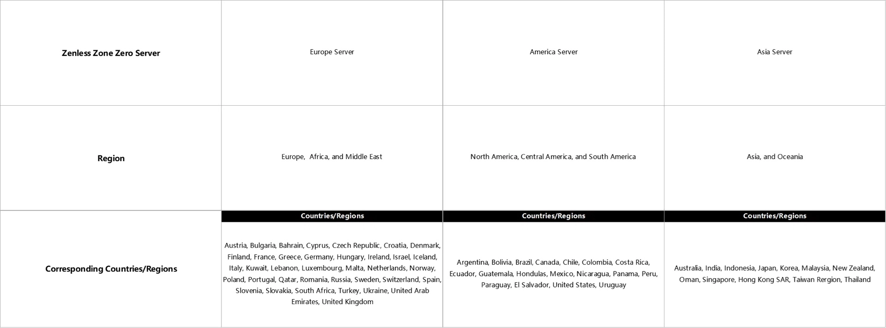

# Account Pre-setup

When you first use Hoyo Buddy, you need to link an email and password or use token. Most of those are in [FAQ](./FAQ.md).

But there's users that use Third-party Platform Login (i.e: Apple ID, Game Center, Google, PlayStation, Microsoft, Facebook and Twitter).

This page will help you setup your HoYoverse account to use with Hoyo Buddy

## As a first time player without an account yet thru any means

If this is the first time you hear about any HoYoverse games and you want to use Hoyo Buddy with your HoYoverse account, please first create a new account on [HoYoverse Account Center](https://account.hoyoverse.com).

Click Sign-in -> Register and follow the on screen prompts.

If you plan to login with third party, please choose the third party provider first. (Google, Facebook, Twitter(X), Apple)

Once linked, a screen may pop-up asking to link the existing email to HoYoverse account. please make sure to link your email and add a password to complete account creation to use Hoyo Buddy with.

**Note**: <u>Third party login without email is possible for Hoyo Buddy, but you must use Google, Apple, Twitter (X) or Facebook to login to HoYoLAB and ONLY DevTools is allow to Login. Certain Features of Hoyo Buddy will be limited.</u>

## For existing user

### Linking an email from third-party login account

If you use third-party as your main login. Head to [HoYoverse Account Center](https://account.hoyoverse.com). Go to "Personal Information" and link an email and password.

Once in, Click "Link" next to Link account and follow the on-screen prompt

For In-game Linking, go to User Center and Link your email and password there.

- **Honkai Impact 3rd**: "LV.[XX] [Name]" -> Account -> User Center

- **Genshin Impact**: Paimon Menu -> Settings -> Account -> User Center

- **Honkai: Star Rail**: 

  - *Login Screen*: Settings -> Account -> User Center (Recommended if you don't want to download the entire game)

  - *In-Game*: Phone -> Account Settings -> User Center

- **Zenless Zone Zero**: Menu -> Options -> Account -> USER CENTER

### Linking third-party from email login account

Hoyo Buddy only use Email and Password or DevTools login to access your account. If you wish to link to a third-party platform, please go to Link Account on [HoYoverse Account Center](https://account.hoyoverse.com). Only Facebook and Twitter (X) Platform can be link, for other platfrom, please link them in-game on the device you want link.

- **Game Center**: iOS (In-game)
- **Apple Login**: iOS (In-game), Web (only first sign-up).
- **Google**: Android (In-game), PC* (In-game), Web (only first sign-up).
- **Microsoft Account**: Xbox** (In-game).
- **PlayStation Network**: PlayStation**/\*** (In-game)

*To Link your existing HoYo account to your Google Account on PC, please download [Genshin Impact](https://genshin.hoyoverse.com) or [Honkai Impact 3rd](https://honkaiimpact3.hoyoverse.com/) - Google Play PC on the Google Play Store from the official Game Page. Google Play Games PC will be install, later by HoYoPlay installer of the specifc game.

Once installation Completed and the game is ready to run, launch the game and login to your existing HoYoverse account.

Once logged in, a screen will pop-up asking to login with Google Play. Follow the on screen instruction to complete the linking process.

**Note**: _Google Play PC version only allow linking. To unlink your Google account, please Unlink it on your Android Device._

**Please see the below for more information.

***PSN account and Game accounts are region bound by PSN account region, see the below for more info.

## Linking from Console

By using Hoyo Buddy, you will able to use Features that Mobile and PC user have.

For new users starting on console, please follow the [Linking an email from third-party login](./Before-Start.md#linking-an-email-from-third-party-login)

For existing users, follow the instruction below.

**[PlayStation Only]**: Please check your region account before linking your HoYo account to PSN. See the chart below. Applies to all HoYoverse games

Login to one of the HoYo games and choose "Already have an Account, log in directly"

If you only use third-party login, Scan the QR Code if you wish to only use DevTools login.

When using QR Link, check if the the information is correct.

**Note**: PSN User please double check if your account region is correct with your server region. If the game asks you to link create a new game account, close the game and double check if your region account is correct as the [chart](./Before-Start.md#linking-from-console) said.

If you are sure the region is correct. Confirm the link.

**Congrats! You can now play any HoYoverse game cross-platform with Hoyo Buddy enhancement!** Check out [Getting Started](./Getting-Started.md) to Setup Hoyo Buddy
