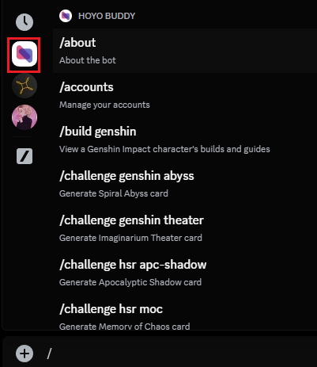

# Bắt đầu

You can use Hoyo Buddy without inviting it into any Discord servers. If you need help setting up Hoyo Buddy, please join our [Discord server](https://link.seria.moe/hb-dc).

:::note

Nếu bạn không có tài khoản Hoyoverse (bạn đăng nhập bằng dịch vụ của bên thứ 3 như Google) hoặc bạn là người chơi console, vui lòng kiểm tra [Hướng dẫn thiết lập trước tài khoản](./Before-Start.md).

:::

Đọc thêm: [Hoyo Buddy có an toàn không?](./Account-Security.md)

## Thử ngay Hoyo Buddy

1. Click on [this link](https://one.hb.seria.moe/install).

2. Chọn tùy chọn bạn muốn.

3. Go to Discord and type `/`, then select Hoyo Buddy's icon (blue and red triangles). You can now see all of Hoyo Buddy's commands, select any command to run it.

### Post-Set Up

You can toggle features like auto daily check-in and auto code redemption for individual accounts using `/accounts`.
The "Set account as public" toggle controls whether your account is visible to others when they select you as the command user.

You can use the `/settings` command to control the theme of images generated by Hoyo Buddy (light or dark theme), and the language of contents displayed by Hoyo Buddy.

## Reporting Issues and Giving Suggestions

Please join our [Discord server](https://link.seria.moe/hb-dc).
