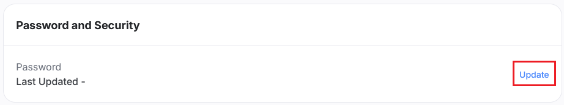

# 账号前置准备指南

:::note

如果你已拥有 Hoyoverse 账号，你可以跳过此指南，直接前往 [开始使用](./Getting-Started.md)。

设置 Hoyoverse 账号仅在你想使用电子邮箱与密码登录方式时需要。如果你希望使用 DevTools 登录，则可跳过此指南。[我应该选择哪种登录方式？](./FAQ.md#我应该选择哪种登录方式) If you wish to login with DevTools, you can skip this guide. [Which login method should I use?](./FAQ.md#which-login-method-should-i-use)

:::

## 我使用第三方服务登录

「第三方服务」是指 Google、Apple、Facebook、X 等平台。

首先，进入 [HoYoverse 账号中心](https://account.hoyoverse.com)。

点击「登录」，然后选择你用于游戏登录的第三方提供商。

登录后，可能出现以下三种情况：

### 链接新账号

这表示你使用的电子邮箱尚未链接任何 Hoyoverse 账号。输入你想要的密码并点击「绑定」，这将创建一个新的 Hoyoverse 账号，并将其与你使用的第三方登录绑定。 Enter a desired password and click "Link", this will create a new Hoyoverse account and bind it to the third-party login you used.

之后，你就可以使用该电子邮箱与密码登录 Hoyo Buddy。

### 绑定电子邮箱

这表示你使用第三方提供商登录时，Hoyoverse 已自动创建了一个账号。点击「绑定」。 Click "Link".

在下一页，于「密码与安全性」部分点击「管理」。

点击「更新」并按照指示为你的账号设置密码。

之后，你就可以使用该电子邮箱与密码登录 Hoyo Buddy。

### 绑定至现有账号

这表示已存在一个与你电子邮箱相同的 Hoyoverse 账号。输入该 Hoyoverse 账号的密码并点击「绑定」，即可将第三方登录绑定至该现有账号。如果忘记密码，点击「有问题吗？」 -> 「忘记密码？」以重置。 Enter the password of this Hoyoverse account and click "Link" to bind the third-party login to the existing account. If you forgot the password, click "Having problems?" -> "Forgot Password?" to reset it.

之后，你就可以使用该电子邮箱与密码登录 Hoyo Buddy。

### 密码上次更新日期为「-」

按照 [绑定电子邮箱](#绑定电子邮箱) 的步骤为你的账号设置密码。

### 其他情况

若遇到此处未列出的情况，请加入 [Discord 服务器](https://link.seria.moe/hb-dc) 寻求帮助。

## 我是主机玩家

:::note

如果你的 PlayStation 或 Xbox 账号已链接至 Hoyoverse 账号，你可以跳过此指南，直接前往 [开始使用](./Getting-Started.md)。

:::

### 如何进入用户中心

- **原神**: 派蒙菜单 -> 设置 -> 账户 -> 用户中心

- **Honkai: Star Rail**:

  - 登录界面: 设置 -> 账户 -> 用户中心 (如果你不想下载整个游戏，建议使用此方法)

  - 游戏内: 手机 -> 账户设置 -> 用户中心

- **绝区零**: 菜单 -> 选项 -> 账户 -> 用户中心

### 如何链接你的 Hoyoverse 账号

:::warning

此方式会创建一个 Hoyoverse 账号并将当前保存于主机上的游戏数据链接至该账号。将数据链接至一个现有的 Hoyoverse 账号是不可行的。 Linking to an existing Hoyoverse account is not possible.

:::

1. 启动你想要链接至 Hoyoverse 账号的游戏。
2. 在游戏中打开[用户中心](#如何进入用户中心)。
3. 选择「链接账号」或类似选项。
4. 按照指示链接你的 Hoyoverse 账号。
