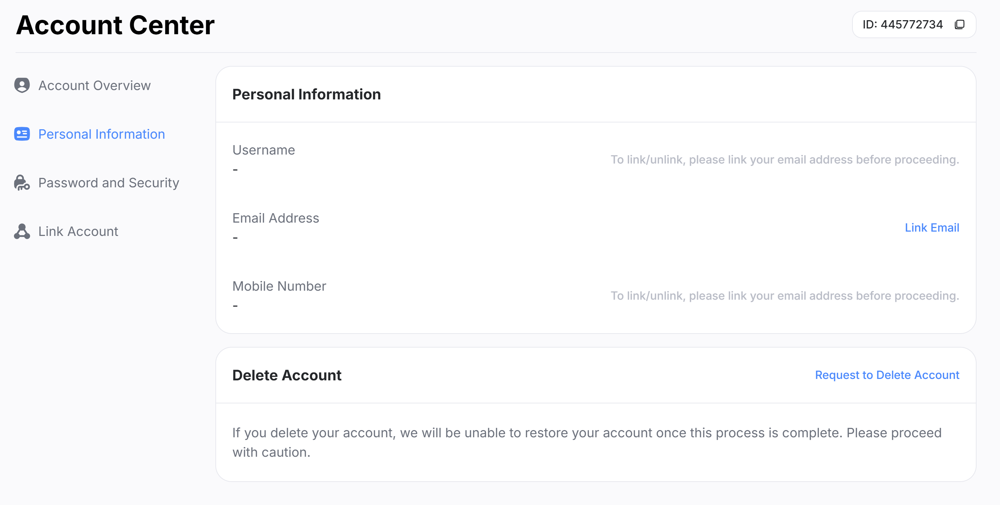

# 帳戶預設

當您第一次使用 Hoyo Buddy 時，您需要連結電子郵件和密碼或使用令牌。大多數這些信息都在[常見問題](./FAQ.md)中。

但是，有些用戶使用第三方平台登錄（例如：Apple ID、Game Center、Google、PlayStation、Microsoft、Facebook 和 Twitter）。

此頁面將幫助您設置 HoYoverse 帳戶以使用 Hoyo Buddy。

## 作為首次使用且尚未通過任何方式擁有帳戶的玩家

如果這是您第一次聽說 HoYoverse 遊戲並且您想使用 Hoyo Buddy 與您的 HoYoverse 帳戶，請首先在[HoYoverse 帳戶中心](https://account.hoyoverse.com)創建一個新帳戶。

點擊登錄 -> 註冊並按照屏幕上的提示操作。

如果您計劃使用第三方登錄，請首先選擇第三方提供商。（Google、Facebook、Twitter(X)、Apple）

連結後，可能會彈出一個屏幕要求將現有的電子郵件連結到 HoYoverse 帳戶。請確保連結您的電子郵件並添加密碼以完成帳戶創建，以便使用 Hoyo Buddy。

**注意**：<u>Hoyo Buddy 可以使用無電子郵件的第三方登錄，但您必須使用 Google、Apple、Twitter (X) 或 Facebook 登錄 HoYoLAB，並且僅允許使用 DevTools 登錄。某些 Hoyo Buddy 功能將受到限制。</u>

## 對於現有用戶

### 從第三方登錄帳戶連結電子郵件

如果您使用第三方作為主要登錄方式，請前往[HoYoverse 帳戶中心](https://account.hoyoverse.com)。進入“個人信息”並連結電子郵件和密碼。

進入後，點擊“連結”旁邊的連結帳戶並按照屏幕上的提示操作。

對於遊戲內連結，請前往用戶中心並在那裡連結您的電子郵件和密碼。

- **崩壞3**： "LV.[XX] [名稱]" -> 帳戶 -> 用戶中心

- **原神**：派蒙菜單 -> 設置 -> 帳戶 -> 用戶中心

- **崩壞：星穹鐵道**：

  - *登錄畫面*：設置 -> 帳戶 -> 用戶中心（如果您不想下載整個遊戲，建議使用此方法）

  - *遊戲內*：手機 -> 帳戶設置 -> 用戶中心

- **絕區零**：菜單 -> 選項 -> 帳戶 -> 用戶中心

### 從電子郵件登錄帳戶連結第三方

Hoyo Buddy 只使用電子郵件和密碼或 DevTools 登錄來訪問您的帳戶。如果您希望連結到第三方平台，請前往[HoYoverse 帳戶中心](https://account.hoyoverse.com)的連結帳戶。僅能連結 Facebook 和 Twitter (X) 平台，對於其他平台，請在您想要連結的設備上在遊戲內連結。

- **Game Center**：iOS（遊戲內）
- **Apple 登錄**：iOS（遊戲內），網頁（僅首次註冊）。
- **Google**：Android（遊戲內），PC*（遊戲內），網頁（僅首次註冊）。
- **Microsoft 帳戶**：Xbox**（遊戲內）。
- **PlayStation Network**：PlayStation**/\***（遊戲內）

*要將現有的 HoYo 帳戶連結到您的 Google 帳戶，請在 Google Play 商店從官方遊戲頁面下載[原神](https://genshin.hoyoverse.com)或[崩壞3](https://honkaiimpact3.hoyoverse.com/) - Google Play PC。Google Play Games PC 將由 HoYoPlay 安裝程序安裝特定遊戲。

安裝完成並且遊戲準備運行後，啟動遊戲並登錄到您的現有 HoYoverse 帳戶。

登錄後，將彈出一個屏幕要求使用 Google Play 登錄。按照屏幕上的說明完成連結過程。

**注意**：_Google Play PC 版本僅允許連結。要取消連結您的 Google 帳戶，請在您的 Android 設備上取消連結。_

**請參閱以下更多信息。

***PSN 帳戶和遊戲帳戶受 PSN 帳戶區域限制，請參閱以下更多信息。

## 從主機連結

通過使用 Hoyo Buddy，您將能夠使用移動和 PC 用戶擁有的功能。

對於在主機上開始的新用戶，請按照[從第三方登錄連結電子郵件](./Before-Start.md#linking-an-email-from-third-party-login)操作。

對於現有用戶，請按照以下說明操作。

**[僅限 PlayStation]**：在將您的 HoYo 帳戶連結到 PSN 之前，請檢查您的區域帳戶。請參閱下表。適用於所有 HoYoverse 遊戲。

登錄到其中一個 HoYo 遊戲並選擇“已經有帳戶，直接登錄”。

如果您僅使用第三方登錄，請掃描 QR 碼，如果您只想使用 DevTools 登錄。

使用 QR 連結時，請檢查信息是否正確。

**注意**：PSN 用戶請仔細檢查您的帳戶區域是否與您的伺服器區域一致。如果遊戲要求您創建一個新遊戲帳戶，請關閉遊戲並仔細檢查您的區域帳戶是否正確，如[圖表](./Before-Start.md#從主機連結)所示。

如果您確定區域正確，請確認連結。

**恭喜！您現在可以使用 Hoyo Buddy 增強功能跨平台遊玩任何 HoYoverse 遊戲！** 請查看[入門指南](./Getting-Started.md)以設置 Hoyo Buddy。
