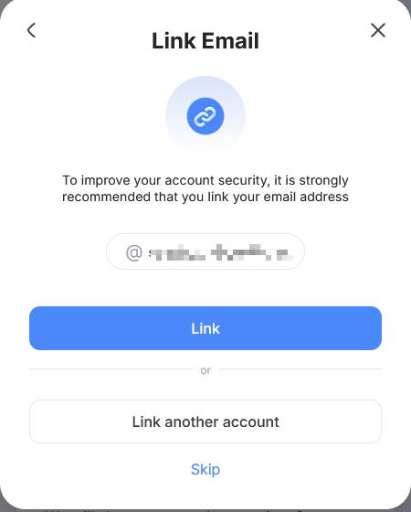

# 帳號前置作業指南

:::note

如果你已擁有 Hoyoverse 帳號，你可以跳過此指南，直接前往 [開始使用](./Getting-Started.md)。

Setting up a Hoyoverse account is only needed if you want to login with the email and password method. If you wish to login with DevTools, you can skip this guide. [Which login method should I use?](./FAQ.md#which-login-method-should-i-use)

:::

## 我使用第三方服務登入

「第三方服務」是指 Google、Apple、Facebook、X 等平台。

首先，進入 [HoYoverse 帳號中心](https://account.hoyoverse.com)。

點擊「登入」，然後選擇你用於遊戲登入的第三方提供商。

登入後，可能出現以下三種情況：

### 連結新帳號

這表示你使用的電子郵件尚未連結任何 Hoyoverse 帳號。輸入你想要的密碼並點擊「綁定」，這將創建一個新的 Hoyoverse 帳號，並將其與你使用的第三方登入綁定。 Enter a desired password and click "Link", this will create a new Hoyoverse account and bind it to the third-party login you used.

之後，你就可以使用該電子郵件與密碼登入 Hoyo Buddy。

### Link Email

這表示你使用第三方提供商登入時，Hoyoverse 已自動創建了一個帳號。點擊「綁定」。 Click "Link".

在下一頁，於「密碼與安全性」部分點擊「管理」。

點擊「更新」並按照指示為你的帳號設置密碼。

之後，你就可以使用該電子郵件與密碼登入 Hoyo Buddy。

### Link to an Existing Account

This means a Hoyoverse account with the same email already exists. Enter the password of this Hoyoverse account and click "Link" to bind the third-party login to the existing account. If you forgot the password, click "Having problems?" -> "Forgot Password?" to reset it.

之後，你就可以使用該電子郵件與密碼登入 Hoyo Buddy。

### 密碼上次更新日期為「-」

Follow the same steps as [Link Email](#link-email) to set a password for your account.

### 其他情況

若遇到此處未列出的情況，請加入 [Discord 伺服器](https://link.seria.moe/hb-dc) 尋求幫助。

## 我是主機玩家

:::note

如果你的 PlayStation 或 Xbox 帳號已連結至 Hoyoverse 帳號，你可以跳過此指南，直接前往 [開始使用](./Getting-Started.md)。

:::

### 如何進入用戶中心

- **原神**: 派蒙菜單 -> 設定 -> 帳戶 -> 用戶中心

- **崩壞：星穹鐵道**:

  - 登入畫面: 設定 -> 帳戶 -> 用戶中心 (如果你不想下載整個遊戲，建議使用此方法)

  - 遊戲內: 手機 -> 帳戶設定 -> 用戶中心

- **絕區零**: 選單 -> 選項 -> 帳戶 -> 用戶中心

### 如何連結你的 Hoyoverse 帳號

:::warning

This method will create a new HoYoverse account and link the current saved data on your console to that new account. Linking to an existing Hoyoverse account is not possible.

:::

1. 啟動你想要連結至 Hoyoverse 帳號的遊戲。
2. 在遊戲中開啟[用戶中心](#如何進入用戶中心)。
3. 選擇「連結帳號」或類似選項。
4. 按照指示連結你的 Hoyoverse 帳號。
