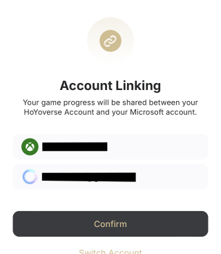

# 帳號前置作業指南

:::note

如果你已擁有 Hoyoverse 帳號，你可以跳過此指南，直接前往 [開始使用](./Getting-Started.md)。  

設定 Hoyoverse 帳號僅在你想使用電子郵件與密碼登入方式時需要。如果你希望使用 DevTools 登入，則可跳過此指南。[我應該選擇哪種登入方式？](./FAQ.md#我應該選擇哪種登入方式)

:::

## 我使用第三方服務登入

「第三方服務」是指 Google、Apple、Facebook、X 等平台。

首先，進入 [HoYoverse 帳號中心](https://account.hoyoverse.com)。  

點擊「登入」，然後選擇你用於遊戲登入的第三方提供商。  

登入後，可能出現以下三種情況：  

### 連結新帳號

這表示你使用的電子郵件尚未連結任何 Hoyoverse 帳號。輸入你想要的密碼並點擊「綁定」，這將創建一個新的 Hoyoverse 帳號，並將其與你使用的第三方登入綁定。

之後，你就可以使用該電子郵件與密碼登入 Hoyo Buddy。

### 綁定電子郵件

這表示你使用第三方提供商登入時，Hoyoverse 已自動創建了一個帳號。點擊「綁定」。  

在下一頁，於「密碼與安全性」部分點擊「管理」。  

點擊「更新」並按照指示為你的帳號設置密碼。

之後，你就可以使用該電子郵件與密碼登入 Hoyo Buddy。

### 綁定至現有帳號

這表示已存在一個與你電子郵件相同的 Hoyoverse 帳號。輸入該 Hoyoverse 帳號的密碼並點擊「綁定」，即可將第三方登入綁定至該現有帳號。如果忘記密碼，點擊「有問題嗎？」 -> 「忘記密碼？」以重置。

之後，你就可以使用該電子郵件與密碼登入 Hoyo Buddy。

### 密碼上次更新日期為「-」

按照 [綁定電子郵件](#綁定電子郵件) 的步驟為你的帳號設置密碼。

### 其他情況

若遇到此處未列出的情況，請加入 [Discord 伺服器](https://link.seria.moe/hb-dc) 尋求幫助。

## 我是主機玩家

### 我沒有 Hoyoverse 帳號

前往 [HoYoverse 帳號中心](https://account.hoyoverse.com) 並註冊一個帳號。  

註冊完成後，請繼續查看 [我有 Hoyoverse 帳號](#我有-hoyoverse-帳號)。

### 我有 Hoyoverse 帳號

**[僅限 PlayStation]**：在將 HoYo 帳號綁定至 PSN 前，請檢查你的區域帳號是否正確，參考下表。適用於所有 HoYoverse 遊戲。  

啟動遊戲並選擇「已有帳號，直接登入」。  

:::tip

如果未看到此畫面，表示你的遊戲帳號已經綁定至 Hoyoverse 帳號。你可以跳過此指南，直接前往 [開始使用](./Getting-Started.md)。

:::

使用你現有或剛創建的 Hoyoverse 帳號登入。  

#### Xbox 玩家

確認信息是否正確。  

#### PlayStation 玩家

:::info

PSN 用戶請務必再次確認你的帳號區域是否與伺服器區域一致。如果遊戲提示你創建一個新遊戲帳號，請關閉遊戲並再次確認你的區域帳號是否正確（參見表格）。  

:::

確認區域正確後，完成連結。

**恭喜！你現在可以使用 Hoyo Buddy 的增強功能跨平台遊玩任何 HoYoverse 遊戲！** 請查看 [開始使用](./Getting-Started.md) 完成 Hoyo Buddy 的設置。
